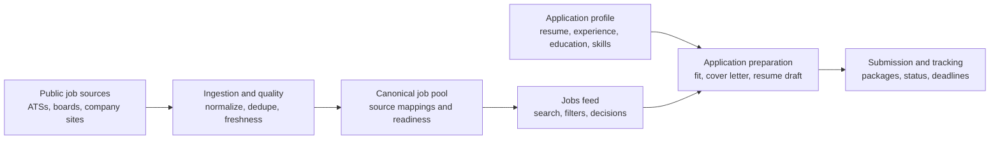

<p align="center">
  
</p>

<h1 align="center">Apply Overflow</h1>

<p align="center">
  A North America-focused job search and application workspace for knowledge-worker roles.
</p>

<p align="center">
  <a href="#what-it-does">What it does</a> ·
  <a href="#a-walkthrough-for-job-seekers">Walkthrough</a> ·
  <a href="#quick-start">Quick start</a> ·
  <a href="#common-workflows">Workflows</a> ·
  <a href="#development-and-release-flow">Development</a> ·
  <a href="#operations">Operations</a>
</p>

Apply Overflow brings job discovery, job decisions, application materials, and
tracking into one product. It is designed to save time without turning
applications into blind bulk submissions: each job is classified as
**ready to apply**, **review required**, or **manual only**, with the reason
available to the user.

## What It Does

### For job seekers

- Search a deduplicated, freshness-aware job feed at `/jobs`.
- Describe a target role in natural language, use focused filters, and keep
  structured filters saved for the next visit.
- Decide quickly from the feed: save, pass, open details, or begin an
  application review.
- Keep applications, deadlines, submissions, and follow-up status in one
  tracker.
- Build an application profile from structured contact information, education,
  experience, projects, skills, preferences, links, and uploaded resumes.
- Upload PDF or DOCX resumes, extract their content, and use AI-assisted review
  to merge useful information into the profile.
- Generate job-specific fit analysis, focused cover letters, and selected
  resume drafts without changing the original profile content.

### For operators

- Ingest from public job boards, ATSs, APIs, and company career sources.
- Normalize, deduplicate, classify, track source mappings, and retire stale
  records while preserving trustworthy live listings.
- Monitor ingestion, discovery, URL health, ranking, and feed summaries under
  the restricted `/ops/*` surfaces.
- Run web, ingestion, source-worker, maintenance, and backup responsibilities
  independently in Docker-based deployments.

## A Walkthrough For Job Seekers

You do not need to understand job ingestion, AI models, or database terms to
use Apply Overflow. The usual path is straightforward:

1. **Set up your application profile.** Add your contact details, links,
   education, experience, projects, skills, work authorization, and job
   preferences. Uploading a resume can help extract these details, but you keep
   control over what is merged into your profile.
2. **Describe what you want.** On **Jobs**, type a title or a plain-language
   request such as "junior data analyst roles in Toronto, hybrid or remote." Use
   filters for location, work mode, experience level, salary, and more. Your
   structured filters can stay saved for the next visit.
3. **Make a quick decision.** Each listing provides its company, location,
   source, timing, and application readiness. Save promising roles, pass on
   irrelevant ones, or open the detail page when you want the full context.
4. **Prepare only when a job is worth it.** In the application review flow,
   choose a resume draft, review the fit analysis, add notes, and generate or
   edit a cover letter. The original profile remains unchanged.
5. **Keep the record.** After applying, use **Applications** to retain the
   submission, documents, notes, status, and deadlines in one place.

### What The Main Screens Mean

| Screen | What you do there | What you get |
| --- | --- | --- |
| **Jobs** | Search, describe a target role, filter, sort, save, pass, or open a job. | A focused live-job board rather than a raw dump of scraped listings. |
| **Job details** | Review source context, readiness, and why the role matches before leaving the product. | Enough context to decide whether to spend time applying. |
| **Documents** | Upload resumes, manage source files, prepare cover letters, and build focused resume drafts. | Application materials that are reusable but can still be tailored per role. |
| **Profile** | Maintain the facts behind your applications. | A structured source of truth that improves job matching and document quality. |
| **Applications** | Record submitted applications and their next steps. | A durable history of packages, statuses, reminders, and deadlines. |

### Readiness Labels

| Label | Meaning | Recommended action |
| --- | --- | --- |
| **Ready to apply** | The source and application path meet the current automation and quality checks. | Review the material, then continue with the application flow. |
| **Review required** | The role is relevant, but a person should confirm an important detail first. | Open the detail page and verify the highlighted reason. |
| **Manual only** | The application should be completed outside the automated flow. | Use the trusted outbound link and track the result afterward. |

### Example: From Search To Submitted Application

> Maya is looking for entry-level software engineering jobs in Canada. She adds
> her education, two projects, and a resume to her profile. On **Jobs**, she
> searches for "software engineer, Toronto or remote, early career" and saves
> a few useful filters. She opens a promising role, checks the source and
> readiness label, then creates a focused resume draft that selects only her
> most relevant projects. After reviewing the generated cover letter, she
> submits the application and records it in **Applications** with the deadline.

## Product Flow



The public-facing job number is the filtered board metric in
`JobFeedSummaryCache.liveJobCount`, not the broader lifecycle count of canonical
records. This keeps the number shown in the product aligned with what a user can
actually browse at `/jobs`.

## Core Workspaces

| Workspace | Purpose | Main route |
| --- | --- | --- |
| Jobs | Browse, search, filter, save, pass, and review trusted live jobs. | `/jobs` |
| Top Picks | Review ranked recommendations based on the profile and behavior. | `/jobs/top-picks` |
| Applications | Track application packages, submissions, statuses, and deadlines. | `/applications` |
| Documents | Manage uploaded files, resume variants, cover letters, and resume drafts. | `/documents` |
| Resume Builder | Select profile-backed entries, review AI revisions, and create a focused resume draft. | `/documents/resume-builder` |
| Profile | Maintain the structured source of truth for application material. | `/profile` |
| Operations | Inspect ingestion, source health, job quality, and ranking diagnostics. Restricted to `OPS_ADMIN_EMAILS`. | `/ops/*` |

## Quick Start

### Prerequisites

- Node.js and npm
- PostgreSQL reachable through `DATABASE_URL`
- Optional: OpenAI, Google OAuth, SMTP, and S3-compatible storage credentials

### Run locally

```bash
git clone <repository-url>
cd autoapplication
npm ci

cp .env.example .env
# Set DATABASE_URL and any optional integration credentials in .env.

npx prisma migrate dev
npx prisma db seed

# Start the web app only. This is the safer default for UI work.
npm run dev -- --no-daemon
```

Open `http://localhost:3000` unless a different `PORT` is configured. To run the
local ingestion daemon with the web app, use `npm run dev` instead.

The app stack checks that it is not accidentally pointed at a suspicious empty
authentication database. Set `ALLOW_EMPTY_AUTH_DB=1` only when that database
target is intentional.

### Add AI features

Add an `OPENAI_API_KEY` to `.env` to enable resume parsing, profile merge
suggestions, fit analysis, cover-letter generation, and resume revisions. The
rest of the product remains usable without it.

### Validate a change

```bash
npm run lint
npm run typecheck
npm run test:unit
npm run build
```

## Common Workflows

### Try the product with local data

```bash
# Load the local data shape and demo records.
npx prisma db seed

# Ingest a real public board into the configured local database.
npm run ingest -- greenhouse --board=vercel

# Preview an ingestion run without writing raw, canonical, or mapping records.
npm run ingest -- ashby --orgs=alchemy,suno --limit=30 --dry-run
```

The default job feed hides demo-backed records that lack a trustworthy live
source. This lets the seed data model the product without inflating the live
board.

### Discover a new source

```bash
# Inspect a pasted job URL or company career page.
npm run source:discover -- \
  --urls=https://jobs.lever.co/example/123,https://apply.workable.com/example/j/ABC/

# Promote validated candidates so the scheduler can ingest them.
npm run source:discover -- --promote=greenhouse:contentful
```

### Maintain the public feed

```bash
# Repair or backfill the feed search index.
npm run jobs:backfill-feed-index -- --mode=all --batch-size=500

# Refresh the cached public-board count used by /jobs.
npm run jobs:refresh-feed-summary

# Review lifecycle and deduplication quality before changing a source policy.
npm run source:report-lifecycle -- --days=60
npm run source:benchmark-dedupe -- --sample-size=100
```

### Back up and retain data

```bash
# Create a database backup.
npm run db:backup

# Use the configured S3-compatible backup storage.
npm run db:backup:storage

# Inspect the focused storage-retention pass before applying it.
npm run db:storage-lifecycle -- \
  --target=old-unreferenced-inactive-canonical-jobs \
  --target=old-unmapped-raw-jobs
```

Do not run a destructive storage action against production without a confirmed
backup. The focused retention targets preserve saved jobs, application
submissions, and application packages.

## Development And Release Flow

Development happens on `dev`. Test changes there before proposing a merge to
`main`.

```text
dev branch -> dev.applyoverflow.com -> pull request -> main -> applyoverflow.com
```

| Environment | Branch | URL | Purpose |
| --- | --- | --- | --- |
| Local | current checkout | `http://localhost:3000` | Fast development and focused testing |
| Staging | `dev` | `https://dev.applyoverflow.com` | Integration and acceptance testing |
| Production | `main` | `https://applyoverflow.com` | User-facing service |

Staging and production are intentionally isolated: they use separate databases,
auth secrets, Postgres volumes, and document-storage buckets. See
[staging and production deployment notes](docs/deployment/staging-production.md)
for VPS setup, safe staging refreshes, deployments, and rollback guidance.

## Architecture

| Area | Primary paths |
| --- | --- |
| App routes | `src/app/jobs`, `src/app/applications`, `src/app/documents`, `src/app/profile`, `src/app/ops` |
| UI components | `src/components/jobs`, `src/components/profile`, `src/components/layout` |
| Domain queries | `src/lib/queries` |
| Ingestion | `src/lib/ingestion`, `scripts/ingest.ts`, `scripts/discover-sources.ts` |
| AI workflows | `src/lib/ai`, `src/lib/resume-ingestion.ts`, `src/lib/profile-resume-service.ts` |
| Persistence | `prisma/schema.prisma`, `prisma/migrations`, `src/lib/db.ts` |
| Storage | `src/lib/storage` |
| Workers | `ecosystem.config.cjs`, `deploy/single-vps/docker-compose.yml` |

### Data model at a glance

- `JobRaw` keeps source payloads for ingestion traceability.
- `NormalizedJobRecord`, `JobCanonical`, and `JobSourceMapping` provide the
  cleaned, deduplicated job representation and source provenance.
- `JobEligibility` keeps the application-readiness decision separate from the
  job's public visibility.
- `SavedJob`, `ApplicationPackage`, `ApplicationSubmission`, and
  `TrackedApplication` keep user decisions and application history durable.
- `UserProfile`, resume variants, documents, and resume-library entries power
  tailored application material without overwriting the user's source profile.

## Configuration

Start from [`.env.example`](.env.example). The most relevant settings are:

| Variable | Required | Why it matters |
| --- | --- | --- |
| `DATABASE_URL` | Yes | PostgreSQL connection for the application, scripts, and Prisma. |
| `OPENAI_API_KEY` | Optional | Enables AI-backed document and job-preparation workflows. |
| `BETTER_AUTH_SECRET` | Required outside local throwaway use | Secures authentication sessions and reset flows. |
| `GOOGLE_CLIENT_ID` / `GOOGLE_CLIENT_SECRET` | Optional | Enables Google sign-in. |
| `SMTP_*` | Optional | Delivers authentication mail and deadline reminders. |
| `STORAGE_*` | Optional | Stores uploaded and generated documents in S3-compatible storage. |
| `OPS_ADMIN_EMAILS` | Required for `/ops/*` | Limits operational dashboards to approved users. |
| `INGESTION_CRON_SECRET` | Recommended in production | Secures scheduled ingestion requests. |

`DATABASE_URL_DO_PRIVATE` can be used by private worker networks. Workers
prefer it when present, unless `DATABASE_PREFER_PRIVATE_FOR_WORKERS=0`.

## Operations

The single-VPS deployment separates responsibilities into containers for the
web app, PostgreSQL, ingestion scheduling, source workers, maintenance workers,
and Caddy. Backups can be written to S3-compatible storage.

```bash
# Build, migrate, and deploy production from the production checkout.
npm run deploy:single-vps

# Deploy the current checkout to staging.
npm run deploy:staging-vps

# Inspect worker status when running a PM2-based worker process.
npm run worker:status
```

Read [the single-VPS migration guide](docs/deployment/single-vps-migration.md)
before operating a server. Keep web and worker database pools constrained, and
run focused lifecycle retention only after a successful backup.

## Product Principles

- **Feed first, apply flow second.** The job feed is the primary product
  surface.
- **Volume with relevance.** North American tech, finance, and general
  knowledge-worker roles are first-class; out-of-scope blue-collar, retail,
  food-service, clinical patient-facing, trades, and production-line work stay
  out of the pool.
- **Quality is visible.** Freshness, source trust, readiness, and reasons are
  explicit instead of hidden behind a single score.
- **User control is durable.** Saved jobs, submissions, packages, and approved
  profile content are preserved through ingestion and retention workflows.
- **Automation is conservative.** Apply Overflow is not a blind mass-apply
  system.

## Further Reading

- [Staging and production deployment](docs/deployment/staging-production.md)
- [Single-VPS migration guide](docs/deployment/single-vps-migration.md)
- [`AGENTS.md`](AGENTS.md) for repository rules and product constraints

The repository state is the source of truth. Keep this README focused on how
the product works and how to run it; keep detailed operational procedures in
`docs/` alongside the code they describe.
